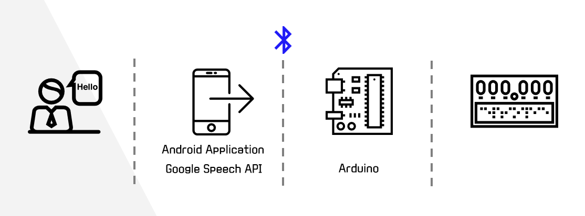
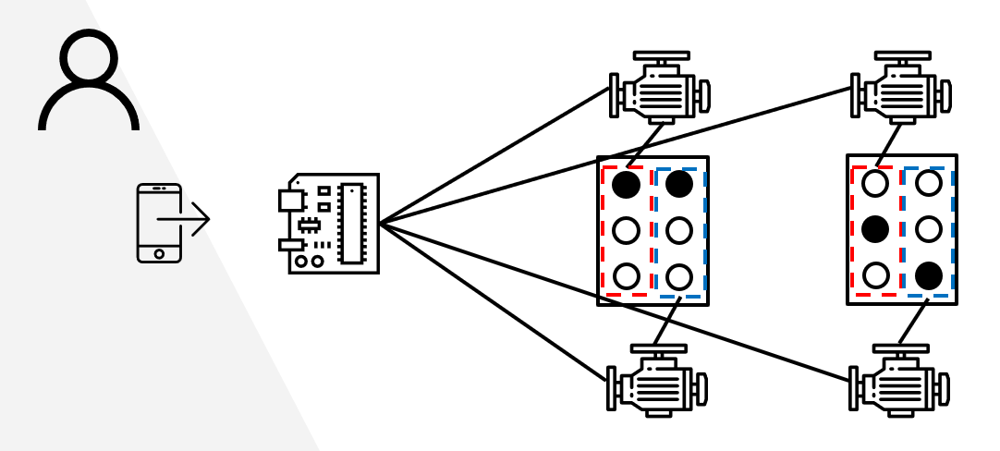
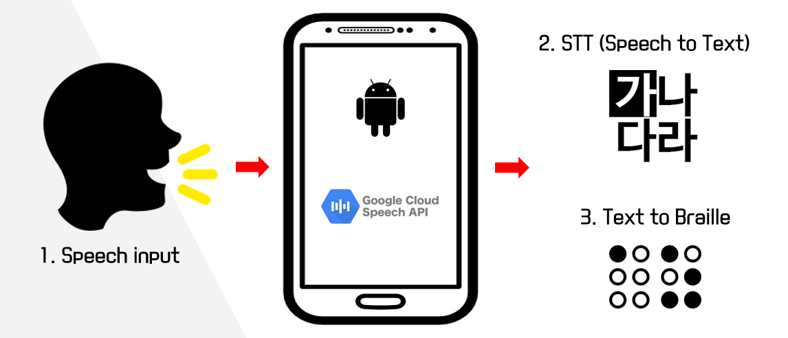

# 2019 SW Convergence Capstone Design
## B.E.E (Be your Eyes and Ears)
한국외국어대학교 융복합소프트웨어 
2019년 종합설계 팀 프로젝트 3조 'B.E.E'의 기술 구조 정리
 

### Overview
- 현재 대한민국에는 5000 ~ 1만 명의 시청각장애인분들이 거주 중
- **그러나**, 시청각중복장애인들이 활용할 수 있는 보조기기의 부재
- 시각장애인을 위한 보조기기가 있지만, 가격이 너무 비싸고 오버스펙

 

### What is B.E.E?
- 저렴한 가격으로 구매할 수 있는 시청각장애인의 **의사소통 보조기**이자,
- 일반인과 소통할 수 있는 **점자 입력기**
- 안드로이드 어플리케이션 + 아두이노 디바이스를 활용하여 구현

 

#### Architecture

> B.E.E의 전체 구조: Android Application + Arduino device

 

> 아두이노 보드와 서보 모터를 활용하는 점자 출력부

 

#### How to work?

