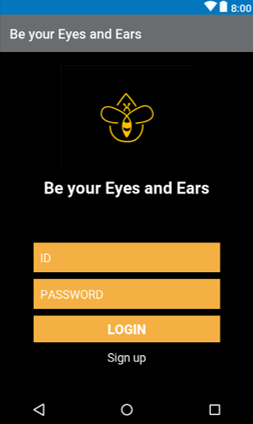
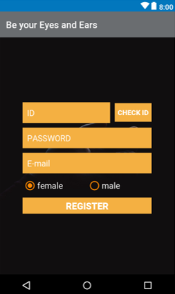
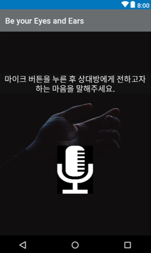
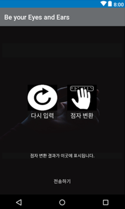
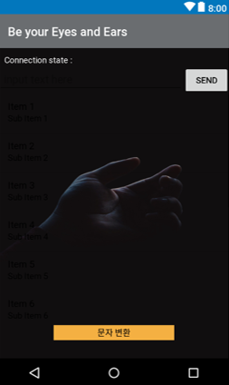
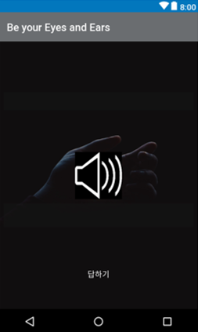
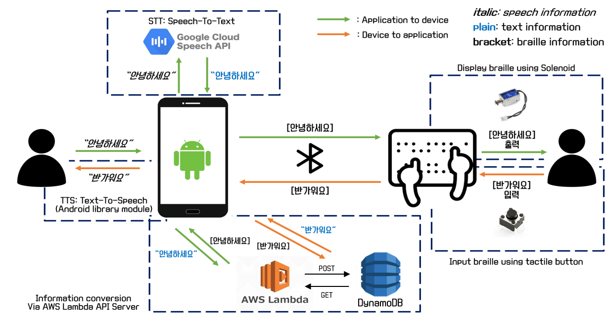
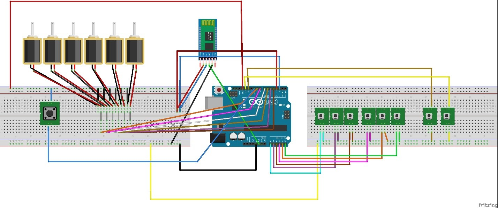
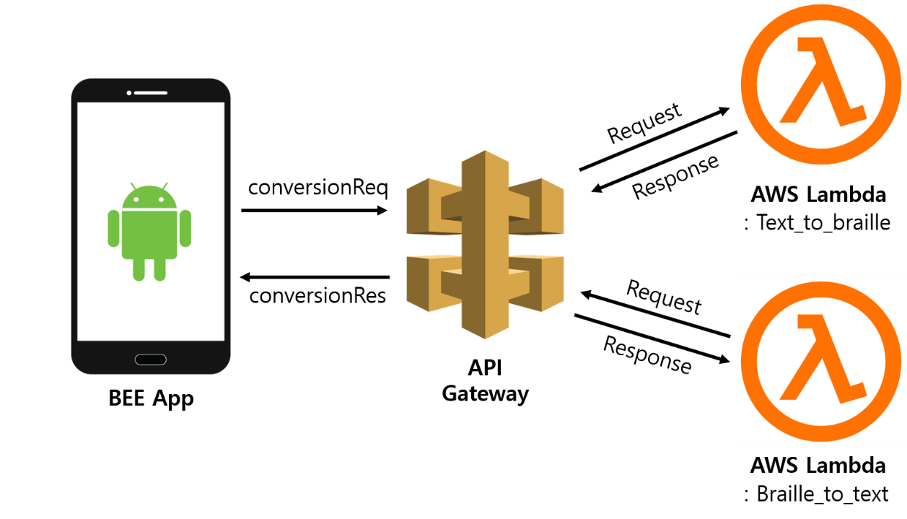
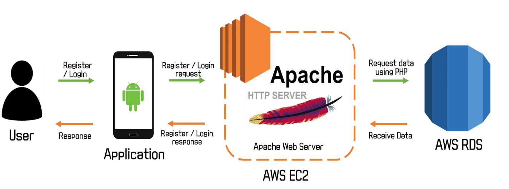

# 2019 HUFS SW Convergence Capstone Design
## BEE (Be your Eyes and Ears)
한국외국어대학교 융복합소프트웨어 
2019년 종합설계 팀 프로젝트 3조 **BEE**의 기술 구조 정리
  

### ▶ Team **BEE**
|  Name  | Major         | Responsibility   | Email            |
| :---:    | :-----------: | :-------------:  | :---------------: |
|  **허 훈**  | 포르투갈어    | Mobile - Android | huffonism@gmail.com |
|  고도현  | 국제스포츠레저 | Web - Node.js    | kodo931228@gmail.com |
|  고용규  | 아랍어통번역   | HW - Arduino     | goyg6123@gmail.com |
|  김서연  | 국제스포츠레저 | Web - Python     | 2seoyeoni2@gmail.com |
|  송무경  | 우크라이나어 | HW - Arduino     | runmksong@gmail.com |
|  이윤주  | 스페인어통번역  | Web - Python     | lyla02217@gmail.com |

 

### ▶ Overview
- 현재 대한민국에는 5000 ~ 1만 명의 시청각장애인분들이 거주 중
- **그러나**, 시청각중복장애인들이 활용할 수 있는 보조기기가 부재함
- 시각장애인을 위한 보조기기 '한소네'가 있지만, 가격이 너무 비싸게 형성되고 오버스펙

 

### ▶ What is BEE?
- 저렴한 가격으로 구매할 수 있는 시청각장애인의 **의사소통 보조기**이자,
- 일반인과 소통할 수 있는 **점자 입력기**
- 안드로이드 어플리케이션 + 아두이노 디바이스를 활용하여 구현

 

### ▶ Android 화면 구성도
|:memo: Page 001|:memo: Page 002|
|:-------------:|:-------------:|
|||

|:memo: Page 003|:memo: Page 004|
|:-------------:|:-------------:|
|||

|:memo: Page 005|:memo: Page 006|
|:-------------:|:-------------:|
|||
 

### ▶ Architecture

> BEE의 전체 구조

 

> 하드웨어 구성도 

> BEE API Server 구성도

> BEE Database Server 구성도

 

